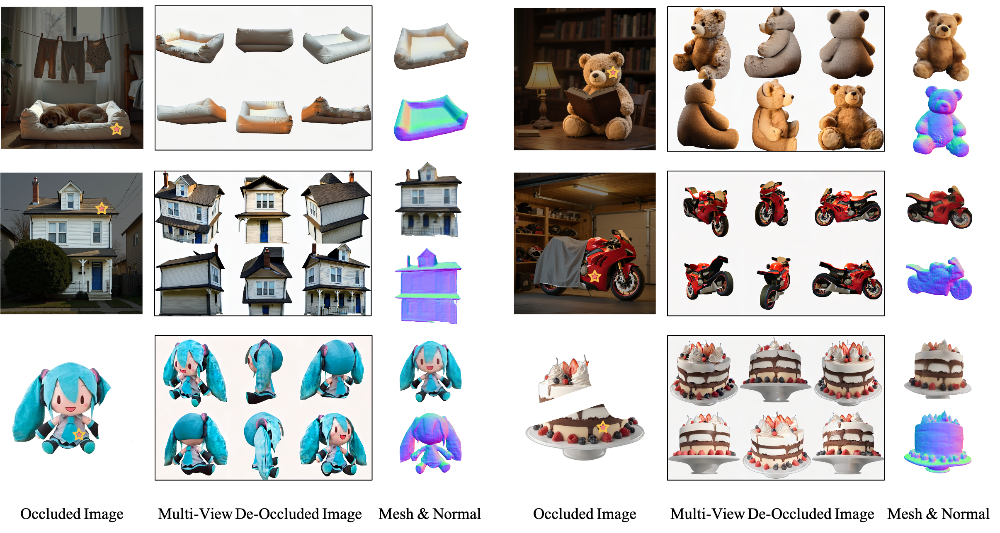

<p align="center">
  <h1 align="center"> <b>DeOcc-1-to-3</b></h1> 
</p>
  
<p align="center">
	<a href="https://arxiv.org/abs/2506.21544"></a>
	<a href=''></a>
<!-- 	<a href=""></a> <br> -->
</p>

<p align="center">
  Official implementation of the paper:<br>
  <strong>“DeOcc-1-to-3: 3D De-Occlusion from a Single Image via Self-Supervised Multi-View Diffusion”</strong>
</p>

<div align="center">
  
</div>

## ⚡ TL;DR

**DeOcc-1-to-3** is a 3D de-occlusion framework.   
From a **single occluded image**, it synthesizes **six structure-consistent novel views**, enabling **faithful Amodal 3D reconstruction**.


<!-- ---

## 📝 Project Overview

**DeOcc-1-to-3** is an end-to-end framework for **occlusion-aware multi-view image generation** from a single occluded image. It leverages **self-supervised fine-tuning of a multi-view diffusion model** to synthesize structurally consistent novel views, enabling **faithful 3D reconstruction** under occlusions without manual annotations. -->

<!-- --- -->

## 🚀 Key Features

✅ Synthesizes **six structurally consistent novel views** from a single occluded image  
✅ **Self-supervised training** with pseudo-ground-truth views generated by a pretrained multi-view diffusion model  
✅ Seamless integration with existing 3D reconstruction pipelines (e.g., InstantMesh)  
✅ Introduces the first **benchmark for occlusion-aware 3D reconstruction**

---

## 🎆 Gradio Demo

https://github.com/user-attachments/assets/750cb886-26bf-41b6-8c25-f1845030a93c


<!-- ## 🔬 Method Overview

<div align="center">
  
</div>

1. **Random Occlusion:** Generate occluded images using SA-1B segmentation masks.  
2. **Pseudo-GT Generation:** Use a frozen multi-view diffusion model to produce six-view pseudo-ground-truths.  
3. **Self-Supervised Fine-Tuning:** Train the student model with a denoising objective to predict consistent novel views from occluded inputs.  
4. **3D Reconstruction:** Feed synthesized views into a downstream reconstruction module (e.g., InstantMesh) to recover complete 3D geometry.

--- -->

<!-- ## 📦 Installation

```bash
git clone https://github.com/Quyans/DeOcc123.git
cd DeOcc123
conda env create -f environment.yml
conda activate deocc123 -->

Code, Dataset, and Models will be released soon, stay tuned!

